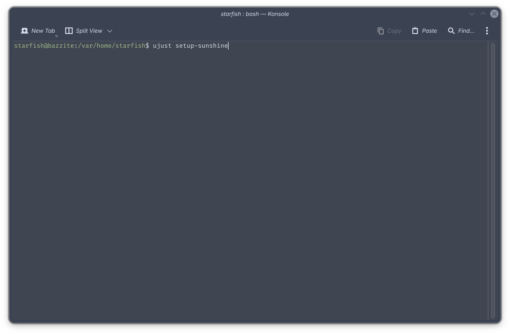
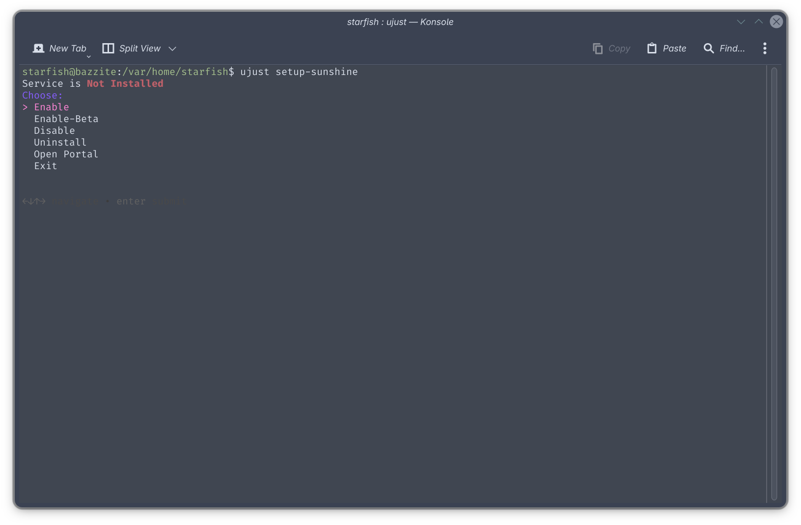

# Changes to Sunshine on Bazzite

!!! info "This change will take effect in an update in the near future, along with the switch to OGC kernel with inputplumber. Look out for announcements!"

## The Change
Sunshine had historically been shipped with the base Bazzite image - but that will no longer be the case. 

## Why is this happening?
The reasoning for this change is due to the lack of a stable package of Sunshine on Fedora 43, and as of April, six months into the Fedora 43 lifecycle, and nearing the release of Fedora 44. 
This forced Bazzite to use the Sunshine-Beta package instead, and had thus caused users to have non-functional streaming after an update numerous times, due to multiple changes to their systemd service name.

## What should I do if I am currently using Sunshine?
The guide below will walk you through switching to the Homebrew Sunshine package if you already actively use Sunshine, so that you will continue to have a working stream from your Bazzite Sunshine host when the update occurs.
=== "Using Bazzite Portal"

    1. Open the Bazzite Portal and select **Sunshine**
    
    2. Select **Enable** or **Enable(Beta)** if you want the beta version of Sunshine
    
    3. A Terminal Window will appear. Wait for the installation to complete and you will be prompted to input your password to enable screen capture through Kernel Mode Setting.
    4. Disable the old Sunshine service by opening a new terminal window and run `systemctl --user disable --now app-dev.lizardbyte.app.Sunshine.service`
    
    5. This is a good time to test if your new setup works - Your settings should persist.

=== "Using the Ujust CLI"

    1. Open a terminal window and run `ujust setup-sunshine`
    
    2. Select **Enable** or **Enable(Beta)** if you want the beta version of Sunshine
    
    3. Wait for the installation to complete and you will be prompted to input your password to enable screen capture through Kernel Mode Setting.
    4. Disable the old Sunshine service with `systemctl --user disable --now app-dev.lizardbyte.app.Sunshine.service`
    
    5. This is a good time to test if your new setup works - Your settings should persist.

## Something went wrong, what should I do?
### `The brew link step did not complete successfully`

To fix this, make the directory by running `mkdir -p /home/linuxbrew/.linuxbrew/Cellar/xkeyboard-config/2.47/share/xkeyboard-config-2`

If you encounter any other issues, feel free to reach out on the [Bazzite Discord](../../community/)!
